# Multi-Agent Workflow Execution

The close process uses a hybrid orchestration approach. The **Orchestrator Agent** initiates and directs workflows based on predefined stages, utilizing LangChain and shared Redis memory to ensure seamless handoffs.

## Execution Flow

```mermaid
sequenceDiagram
    participant User/Scheduler
    participant Orchestrator
    participant Group1 as Trial Bal, Variance, Cash Flow
    participant Group2 as Accrual, RevRec, Expense
    participant Group3 as Intercompany
    participant Group4 as Consolidation, Reporting

    User/Scheduler->>Orchestrator: Trigger Close (Scheduled or Manual)
    
    rect rgb(30, 41, 59)
        Note over Orchestrator,Group1: Stage 1: Parallel Entity Data Validation
        Orchestrator->>Group1: Dispatch Task (Per Entity)
        Group1-->>Orchestrator: Return Extracted Findings
    end

    rect rgb(15, 23, 42)
        Note over Orchestrator,Group2: Stage 2: Sequential Deep Dive Analysis
        Orchestrator->>Group2: Pass Context & Financial Variations
        Group2-->>Orchestrator: Emit Corrections & Adjustments
    end

    rect rgb(30, 41, 59)
        Note over Orchestrator,Group3: Stage 3: Cross-Company Resolution
        Orchestrator->>Group3: Compare Intercompany Activity
        Group3-->>Orchestrator: Produce Eliminations Journal
    end

    rect rgb(15, 23, 42)
        Note over Orchestrator,Group4: Stage 4: Group Rollup & Reporting
        Orchestrator->>Group4: Aggregate All Corrected Ledgers
        Group4-->>Orchestrator: Generate Consolidated Reporting
    end

    Orchestrator->>User/Scheduler: Send Executive Summaries (Email/WebSocket)
```

## Agent Communication Mechanism
All agents participate in a shared state workflow. When the `Trial Balance Validator` flags an account variance, it persists the anomaly into Redis. The `Variance Analysis` agent reads from this shared buffer before drafting its explanations, simulating a real accounting team's collaboration.
