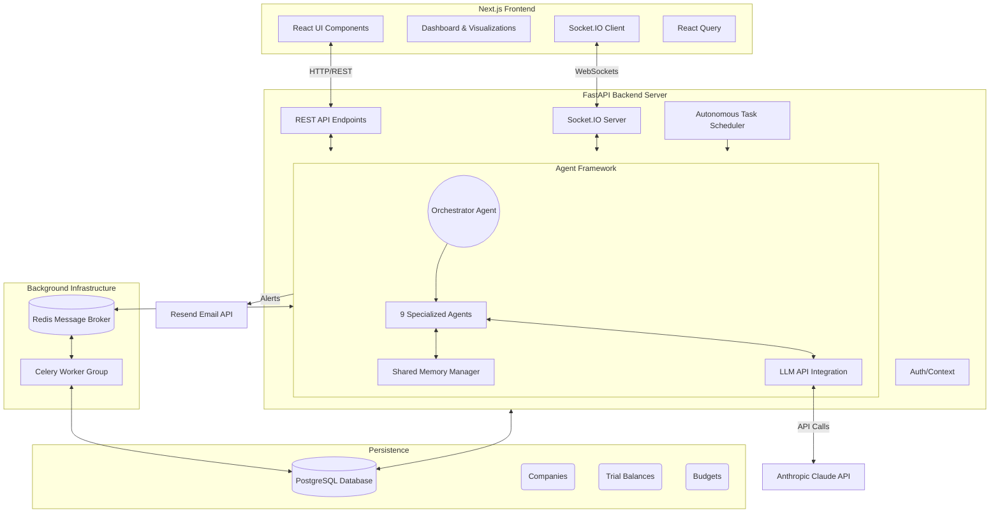

# System Architecture

## Overview
The Month-End Close Orchestrator is built using a modern, scalable technical stack to ensure reliable execution of complex multi-agent reasoning tasks, robust storage, and real-time frontend updates.

## Architecture Diagram

## Component Details
1. **Frontend**: Next.js 14 App Router, styled with Tailwind CSS and shadcn/ui. Uses Recharts for financial aggregations and Socket.IO for real-time agent tracking.
2. **Backend Engine**: FastAPI handles synchronous REST requests and concurrent async agent orchestration.
3. **Database Layer**: PostgreSQL stores financial datasets, entity hierarchies, budgets, and agent interaction logs.
4. **LLM Engine**: LangChain constructs chains that are powered by Anthropic's Claude to resolve complex accounting compliance checks and discrepancies.
