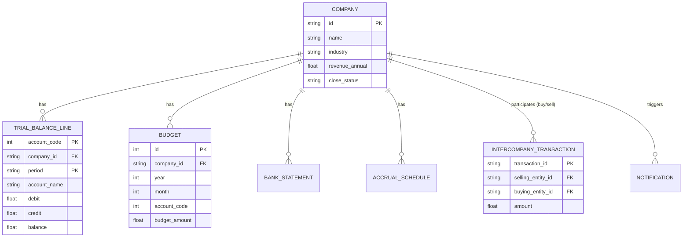

# Database Schema Documentation

Our backend leverages **PostgreSQL** configured via SQLAlchemy ORM.

## High-Level Entity Relationship Diagram

## Core Models
- **Company**: Stores entity metadata, overall operational flags, and standard PE reporting characteristics.
- **TrialBalanceLine**: Holds the canonical records for financial accounts on a per-period basis.
- **Budget**: Master storage for annualized forecasts partitioned by code and month.
- **IntercompanyTransaction**: Log of all activities executing across the boundary of Apex Capital Partners nested entities.
